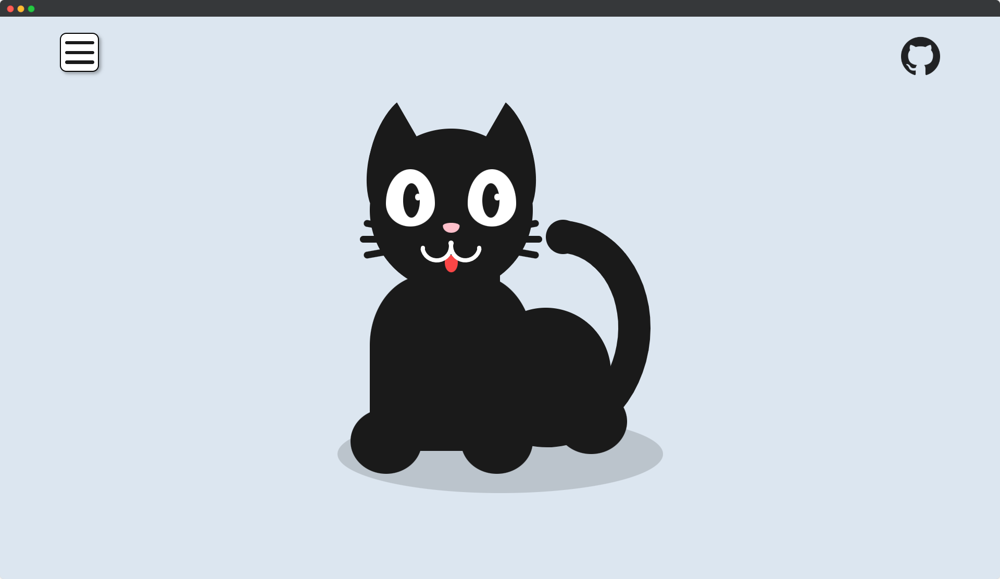
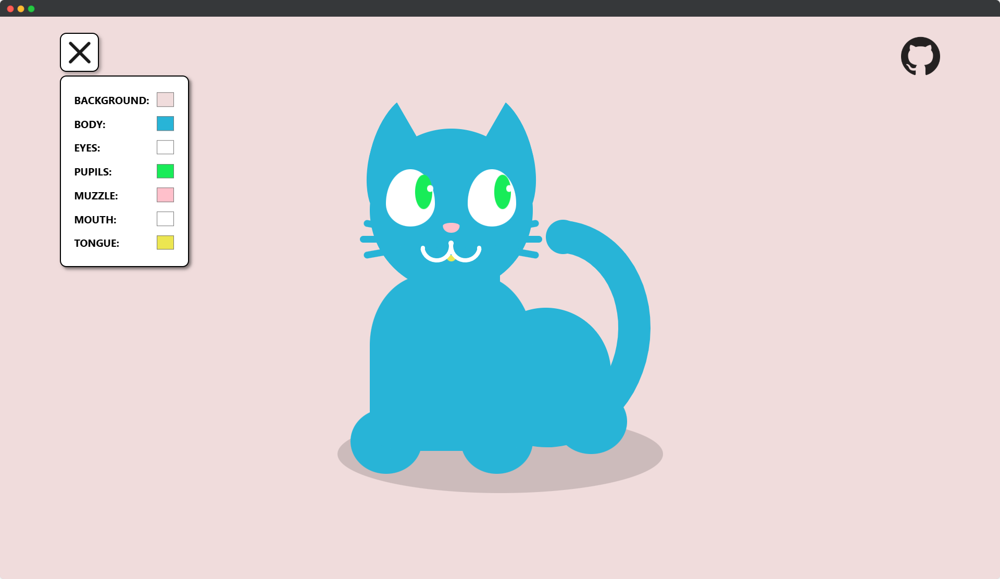

# 🐱 Miv_Kod

  
  &nbsp;
  
  &nbsp;
  

---

## 🎨 Sobre o Projeto

**Miv_Kod** é um projeto escolar simples, criado como parte de uma representação artística que une **arte, tecnologia e interação**.

O projeto conecta esses elementos a uma vocação — neste caso, a vocação escolhida foi a de **desenvolvedor web**.

---

## ⚙️ Tecnologias Utilizadas

O **Miv_Kod** foi desenvolvido utilizando três das tecnologias fundamentais para desenvolvimento web:

- **HTML** e **CSS**: utilizados para construir a interface, com destaque para a criação do gato.
- **JavaScript**: responsável por implementar as interações, permitindo ao usuário escolher as cores do gato e interagir com o menu.

---

## 🖼️ Demonstrações

Veja abaixo duas capturas de tela que ilustram o funcionamento do projeto:

### 📸 Interface Principal

A primeira imagem mostra a tela inicial do projeto, com a ilustração do gato criada com HTML e CSS. O layout é responsivo e representa de forma criativa a vocação de desenvolvedor web.

  

### 🎛️ Customização Interativa

A segunda imagem destaca o menu de customização, que permite ao usuário alterar as cores do gato (olhos, boca, focinho, entre outros) de forma interativa usando JavaScript. Uma funcionalidade simples e divertida que incentiva a criatividade.

  

